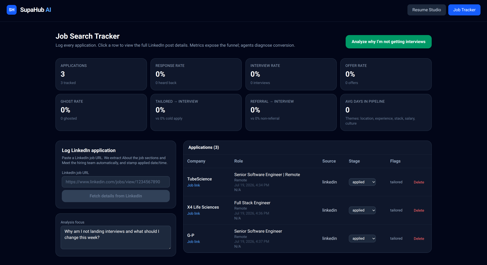

# 🚀 Supahub AI

## Overview

Supahub AI is a smart job application assistant designed to streamline resume refinement, job tracking, and GitHub insights for modern career workflows. It combines an intuitive React-based frontend with a Python backend to help users manage applications, improve resumes, and stay organized.

## Key Features

- ✅ Resume editor and preview experience
- ✅ Job tracking dashboard with job details
- ✅ GitHub repository and profile integration
- ✅ AI-driven recommendations for job applications
- ✅ Clean, modern UI with responsive layout

## Project Structure

- `client/` — React frontend built with Vite and TypeScript
- `server/` — Python backend and ML/AI utilities
- `client/public/image.png` — Preview image displayed in this README

## Usage

1. Open the repository in your local environment.
2. Run the frontend from `client/`.
3. Start the backend from `server/`.
4. Visit the app in your browser and explore the job assistant interface.

## Why Supahub AI?

Supahub AI helps professionals stay organized during their job search by combining resume refinement, job application tracking, and AI insights in one cohesive workspace.

## Get Started

- `cd client && npm install && npm run dev`
- `cd server && pip install -r requirements.txt && python main.py`

## Contact

For questions or contributions, please open an issue or submit a pull request.

---

> Built to accelerate job search productivity with a polished interface and AI-enabled workflow.
